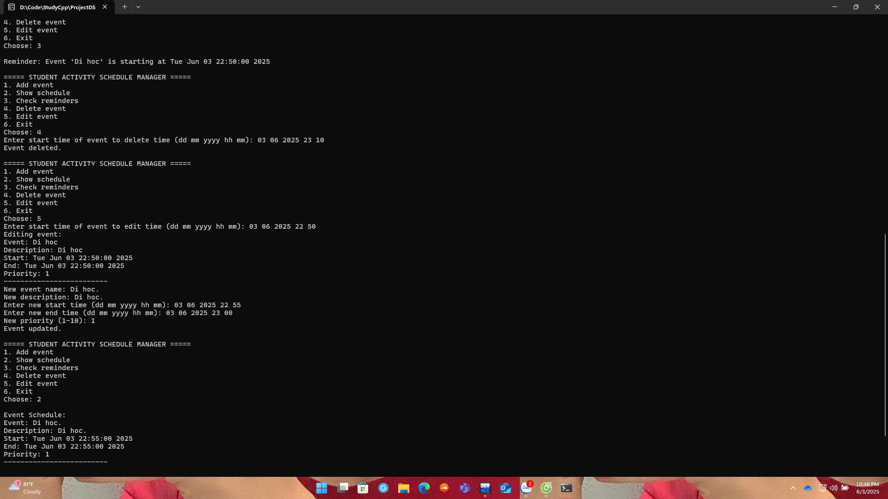
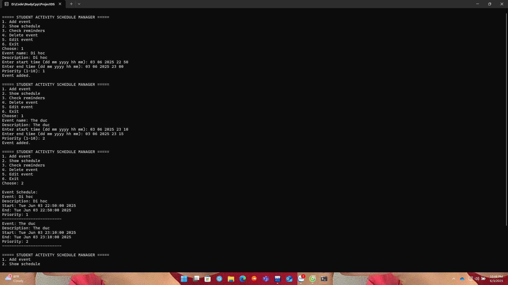

Tên chương trình: Student Activity Schedule Manager
----------------------------------------------------

Mô tả:
-------
Chương trình quản lý lịch hoạt động của sinh viên sử dụng cây AVL để lưu trữ thông tin sự kiện theo thời gian bắt đầu, và sử dụng hàng đợi ưu tiên (priority queue) để nhắc nhở các sự kiện sắp diễn ra.

Chức năng chính:
------------------
1. Thêm sự kiện có thời gian và mức độ ưu tiên.
2. Kiểm tra và hiển thị các sự kiện sắp diễn ra (trong vòng 5 phút).
3. In danh sách sự kiện theo thứ tự thời gian.
4. Chỉnh sửa và xoá sự kiện.
5. Tự động xử lý xung đột lịch dựa trên mức độ ưu tiên.

Giao diện dòng lệnh:
----------------------

Sau khi chạy chương trình, bạn sẽ thấy menu như sau:

===== STUDENT ACTIVITY SCHEDULE MANAGER =====
1. Add event
2. Show schedule
3. Check reminders
4. Delete event
5. Edit event
6. Exit
Choose:

Chi tiết từng chức năng:

1. **Add event – Thêm sự kiện**
    - Nhập:
        - Tên sự kiện
        - Mô tả sự kiện
        - Thời gian bắt đầu (định dạng: dd mm yyyy hh mm)
        - Thời gian kết thúc (cùng định dạng)
        - Mức độ ưu tiên (1–10)
    - Nếu có sự kiện trùng thời gian:
        - Chương trình kiểm tra ưu tiên và cho phép thay thế nếu sự kiện mới có ưu tiên cao hơn.

2. **Show schedule – Hiển thị lịch**
    - Hiển thị các sự kiện đã lên lịch theo thứ tự thời gian.

3. **Check reminders – Kiểm tra nhắc nhở**
    - Hiển thị thông báo nếu có sự kiện sắp bắt đầu trong vòng 5 phút.

4. **Delete event – Xoá sự kiện**
    - Nhập thời gian bắt đầu của sự kiện cần xoá.
    - Nếu sự kiện tồn tại, nó sẽ bị xoá khỏi hệ thống.

5. **Edit event – Chỉnh sửa sự kiện**
    - Nhập thời gian bắt đầu của sự kiện cần chỉnh sửa.
    - Nhập lại toàn bộ thông tin sự kiện như mới.

6. **Exit – Thoát chương trình**

Lưu ý:
-------
- Tất cả dữ liệu sẽ mất sau khi tắt chương trình (không có lưu file).
- Hãy đảm bảo nhập thời gian đúng định dạng.
- Ưu tiên càng cao thì số càng lớn (10 là cao nhất).

Testcases:
---------

